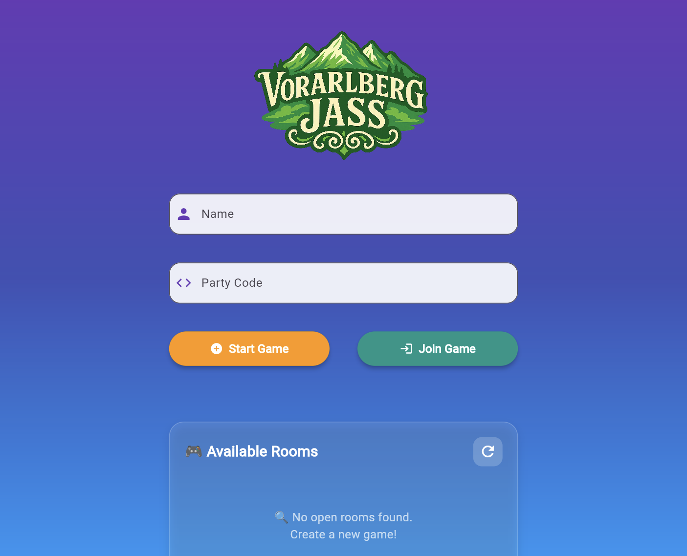
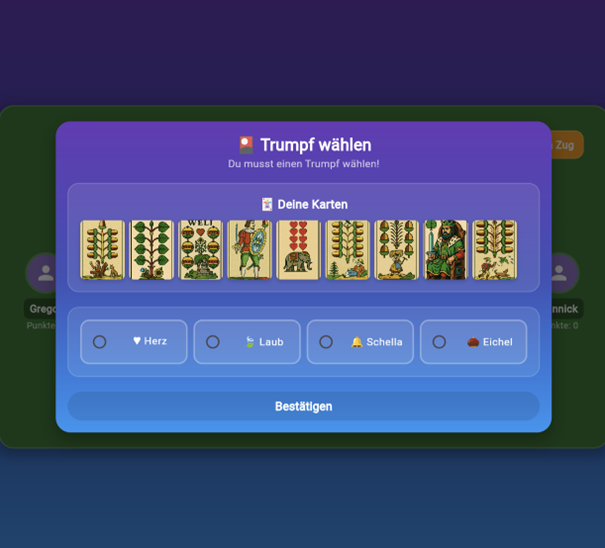
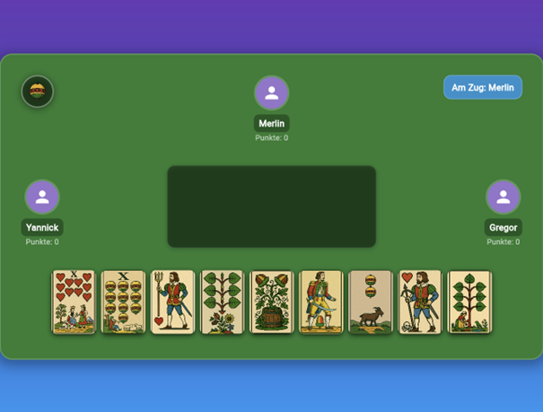

# Link für exe:
https://drive.google.com/drive/folders/1yz2-ojZfXAgDRVsN8vFamoGy_GXcxVFt?usp=drive_link

# Tutorial Jassspiel

## 1. Spiel erstellen

- Name eingeben
  
- "Start Game" drücken
  

## 2. Spiel beitreten (4 Spieler)

- Name eingeben
  
- Party Code eingeben
  
- "Join Game"
  
- oder bei Available Rooms nach gewünschtem Spiel suchen
  

# 3. Spielen

## 3.1 Trumpf wählen

- Di Person mit dem "Weli" Kann 1/4 der Symbole auswählen und bestätigen was dann zum Trumpf wird.

## 3.2 Karten Spielen

- Wenn die Anzeige "Am Zug" Orang ist und etwas wie "Du bist am Zug!" steht kann man eine Karte (Beachte die Jassregeln) in die Mitte Ziehen

Jassregeln gibt es unter: [Die Regeln des Vorarlberger Jass in 7 Schritten einfach erklärt - Jassa.at](https://www.jassa.at/regeln/)
